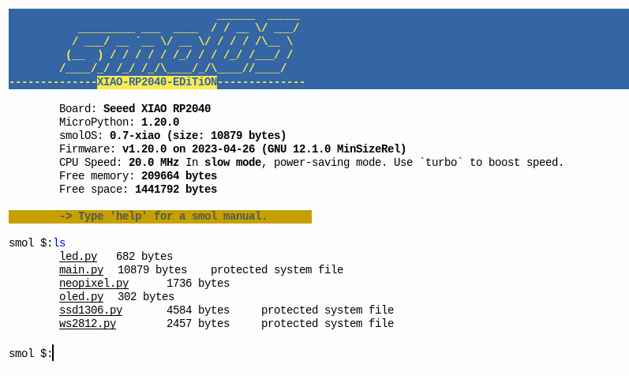
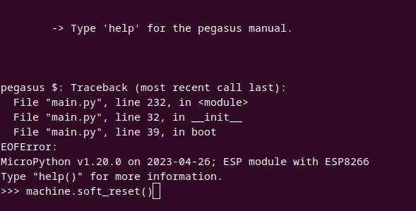
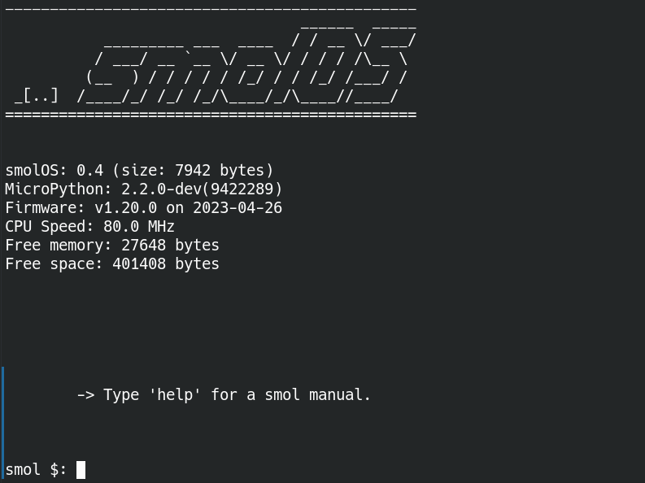
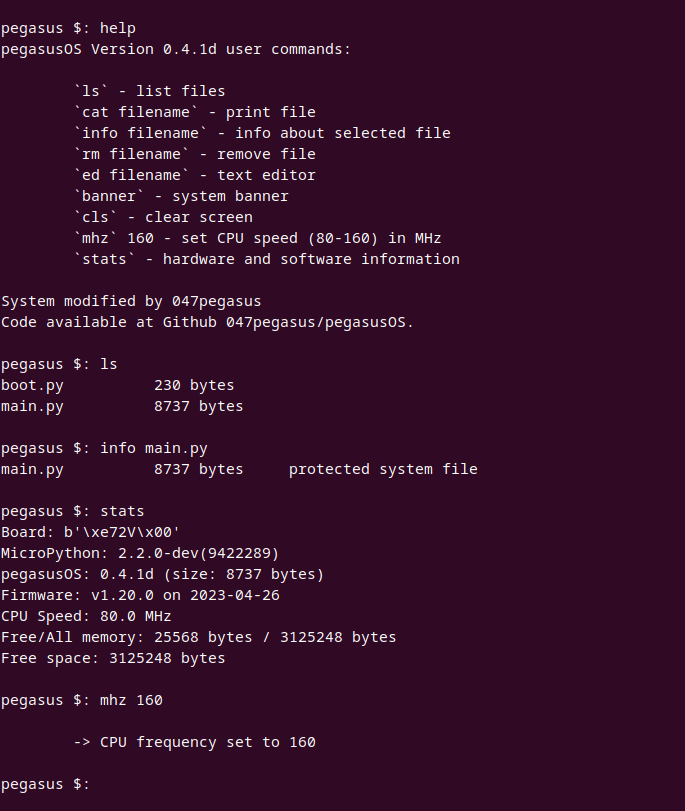
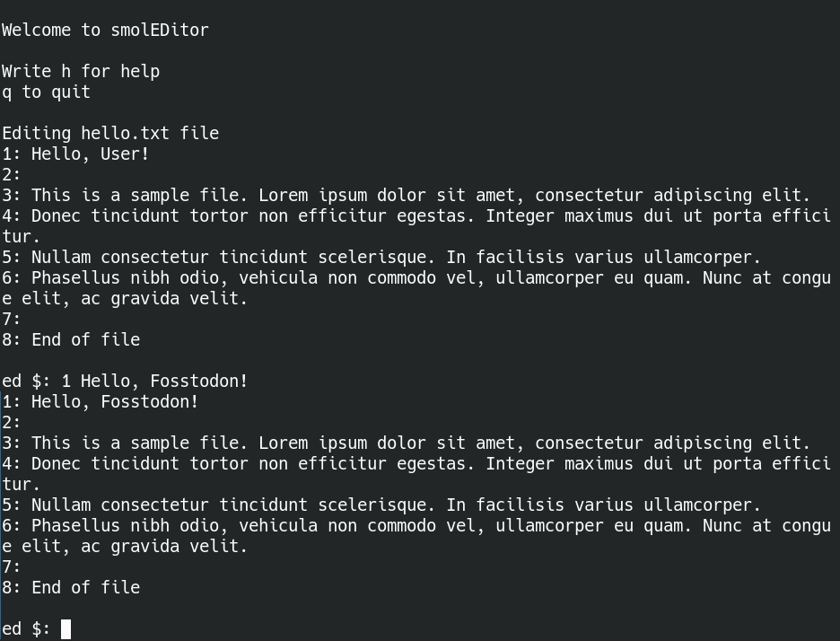

# pegasusOS

pegasusOS - a fork of smolOS which is a tiny and simple operating system for MicroPython (targetting ESP8266 and RP2040) giving the user POSIX-like environment to play.




Latest documentation available at official homepage:
- [smolOS homepage (http)](http://smol.p1x.in/os/)
- [smolOS homepage (https)](https://smol.p1x.in/os/)

## Real Life Usecases

* listing and removing unwanted files on board
* checking free space
* quicly iterating parameters for a program
* (planned) easy expanding OS with own functions coding on the board
* learning basics of operating disk operating system (using and modyfing)
* connecting to network using command line

## pegasusOS Features

* Adding connctivity features to the small device.
* Changes microcontroller into a small working PC
* Homemade for fun and learning
* Super small and fast
* Easy to use, simillar to MS-DOS, POSIX-like environment
* List and manipulates files
* Text editor included (very basic)
* Ability to expand OS functionality with user defined code
* Build on MicroPython
* Stability and simplicity are the main principle behind the code
* Free :)

## Installation

### Super Quick Quide
Just put ```main.py``` into the board (that has latest MicroPython firmware) and restart.

### Detailed Guides
* [ESP8266 Guide](ESP8266.md)
* [XIAO RP2040 Guide](XIAO-RP2040.md)


## Connecting
As normal user:

```
$ picocom /dev/ttyUSB0 -b115200
```
Press ```ctrl+a+x``` to exit.

## Running


First start. Or after flashing new main.py file. Restart the microcontroller:
```
>>> machine.soft_reset()
```

This should restart the device and "boot" you into the pegasusOS. Like so:

```


_____________________________________________________
                                        ____   _____ 
                                       / __ \ / ____|
  _ __   ___  __ _  __ _ ___ _   _ ___| |  | | (___  
 | '_ \ / _ \/ _` |/ _` / __| | | / __| |  | |\___ \ 
 | |_) |  __/ (_| | (_| \__ \ |_| \__ \ |__| |____) |
 | .__/ \___|\__, |\__,_|___/\__,_|___/\____/|_____/ 
 | |          __/ |                   ________               
 |_|         |___/                    \..__../                               
=====================================================
░█████╗░░░██╗██╗███████╗██████╗░███████╗░██████╗░░█████╗░░██████╗██╗░░░██╗░██████╗
██╔══██╗░██╔╝██║╚════██║██╔══██╗██╔════╝██╔════╝░██╔══██╗██╔════╝██║░░░██║██╔════╝
██║░░██║██╔╝░██║░░░░██╔╝██████╔╝█████╗░░██║░░██╗░███████║╚█████╗░██║░░░██║╚█████╗░
██║░░██║███████║░░░██╔╝░██╔═══╝░██╔══╝░░██║░░╚██╗██╔══██║░╚═══██╗██║░░░██║░╚═══██╗
╚█████╔╝╚════██║░░██╔╝░░██║░░░░░███████╗╚██████╔╝██║░░██║██████╔╝╚██████╔╝██████╔╝
░╚════╝░░░░░░╚═╝░░╚═╝░░░╚═╝░░░░░╚══════╝░╚═════╝░╚═╝░░╚═╝╚═════╝░░╚═════╝░╚═════╝░
-------Device Owner: Tanishq @047pegasus------
smolOS Version 0.3
MicroPython: 2.2.0-dev(9422289)
Firmware: v1.20.0 on 2023-04-26
CPU Speed: 80.0 MHz


pegasusInfo: Type [help] for pegasus manual.


pegasus $:
```




If you close the system or encurage a fatal error start OS again. In MicroPython REPL write:
```
>>> pegasusOS()
```

Or restart device:
```
>>> machine.soft_reset()
```

## Using


Write `help` for help :)

### Example user session


### txtEDitor
First application: `ed`! Almost complete but very simple text editor.


